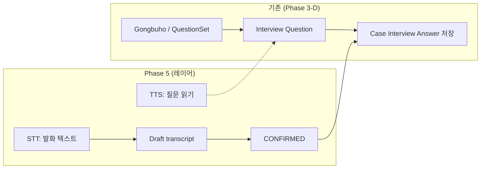

# Voice Interview Flow (VOICE_INTERVIEW_FLOW)

**상태**: Phase **5-A** 흐름 · **5-B** 저장 · **5-C** TTS 문자열 · **5-E** 브라우저 플레이어 UX — 초안 게이트·REST는 Phase **5-D**

**증빙 태그**: `[EVIDENCE-20260523-AIBEOPCHIN-PHASE5A-VOICE-INTAKE-INTERVIEW-LAYER]` · TTS 문안 SSOT는 Phase **5-C** [`VOICE_PROMPT_TTS_SPEC.md`](./VOICE_PROMPT_TTS_SPEC.md)

## 1. 목적

기존 **Gongbuho packet → QuestionSet → Interview question** 바인딩([`GONGBUHO_INTERVIEW_BINDING.md`](../gongbuho/GONGBUHO_INTERVIEW_BINDING.md))을 **재구현하지 않고**, 질문·답변에 **음성 입·출력만 덧붙인다**.

## 2. 레이어링(개념)

| 레이어 | 역할 | 재사용 |
|--------|------|--------|
| **인터뷰 코어** | 질문 ID, 순서, 답변 저장, 공부호/질문셋 규칙 | 기존 서비스·API 유지 |
| **Voice 출력** | 질문 → **TTS 입력 문자열**([`VOICE_PROMPT_TTS_SPEC.md`](./VOICE_PROMPT_TTS_SPEC.md)) → 브라우저 `speechSynthesis` 등 | 문자열 규격 **5-C** · UX **[`VOICE_TTS_GUIDED_UX.md`](./VOICE_TTS_GUIDED_UX.md)** (5-E) |
| **Voice 입력** | 마이크 → STT → `VoiceTranscriptStatus` 상태머신 | 5-B, 5-D |
| **확정 게이트** | `NEEDS_CONFIRMATION`에서만 수정·확정 UI | 본 문서 §4 |

음성 기능이 꺼져 있거나 실패해도 **텍스트 인터뷰는 동일 경로로 동작**해야 한다.

## 3. 권장 E2E 흐름 (텍스트·음성 동시 만족)

설명을 문장으로 정리하면 다음과 같다.

1. **질문**: 서버 또는 클라이언트에서 질문 문구 확정 → 선택적으로 **TTS로 재생**(5-E).
2. **답변**: 사용자 발화 또는 텍직 입력 허용.
3. 발화 경로만 쓸 때: **STT → `CAPTURED` / `NEEDS_CONFIRMATION`**.
4. 사용자가 편집·확인 → **`CONFIRMED`** → **기존 인터뷰 답변 저장 API**(또는 동일 레포 서비스) 호출로 **기존 답변 레코드와 연결**.
5. 거절 시 **`REJECTED`** → 인터뷰 답변 갱신 없음, 선택적 재녹음.

## 4. 상태 전이 (권장)

| From | 동작 | To |
|------|------|-----|
| — | 사용자가 음성 캡처 시작 | `CAPTURED` |
| `CAPTURED` | STT 완료·결과 표시 | `NEEDS_CONFIRMATION` |
| `NEEDS_CONFIRMATION` | 사용자 [확인] (필요 시 텍스트 편집) | `CONFIRMED` |
| `NEEDS_CONFIRMATION` | 사용자 [폐기] 또는 전면 재캡처 | `REJECTED` |
| `CONFIRMED` | 인터뷰 답변 반영 호출 성공 후 | 불변 종료 상태(새 버전은 신규 row/이력) |

**금지**: `CAPTURED` 또는 STT 진행 중에 **인터뷰 최종 저장** 트랜잭션과 같은 요청 바디로 묶어 커밋하는 것 — 반드시 **확정 단계 분리**.

## 5. Voice 추적 이벤트(권장 매핑)

| 이벤트 | 발생 시점 |
|--------|-----------|
| `VOICE_TRANSCRIPT_CREATED` | STT 결과가 저장되어 후보 텍스트로 등록된 때 (`NEEDS_CONFIRMATION` 진입 직후 등) |
| `VOICE_TRANSCRIPT_CONFIRMED` | 사용자 확인 완료 |
| `VOICE_TRANSCRIPT_REJECTED` | 사용자 폐기 |
| `VOICE_INTERVIEW_ANSWER_BOUND` | 확인된 문자열이 **인터뷰 답변 레코드**에 반영 완료 |

저장 구조 선택지:

1. **`VoiceInteractionTrace` 전용 테이블/JSON**(사건 또는 세션별 append-only 블록)
2. **기존 Case 메타 또는 Gongbuho 연계 Trace에 `voice` 서브블록 추가** — 스키마 충돌 시 1안 우선 권장

## 6. Gongbuho questionFlow 연계 메모

- 질문 문구 원천은 **질문셋 렌더링 결과**와 동일해야 한다(음성 안내 문구 불일치 방지). 문자열 합성 순서·`voicePrompt`는 [VOICE_PROMPT_TTS_SPEC.md](./VOICE_PROMPT_TTS_SPEC.md) 참조.
- 공부호 `questionFlow`의 `purpose`/`helpText` 등은 **TTS에 포함할지** 제품 플래그로 제한 가능(너무 길면 접근성 저하).

## 7. 변경 이력

| 날짜 | 내용 |
|------|------|
| 2026-05-23 | Phase **5-E** Guided UX 교차 참조 · `speechSynthesis` 인터뷰 패널 |
